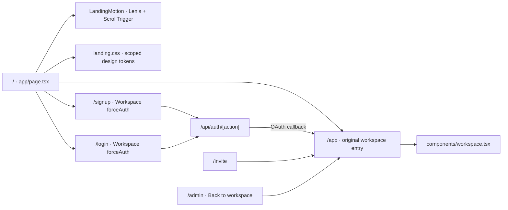

# Public homepage

The public website is `/`; the existing customer workspace is `/app`. Account routes remain `/login`, `/signup`, and `/reset`. Successful OAuth callbacks and invitation continuation lead to `/app`. The public homepage does not fetch workspace data or call the AI API.

## Design and requested skills

The requested repositories were downloaded and their relevant skill instructions applied locally (not installed as global plugins):

- [Taste](https://github.com/Leonxlnx/taste-skill): premium support SaaS direction, existing forest/lime identity, self-hosted Manrope, restrained surfaces and asymmetrical product narrative. Design dials: variance 7, motion 6, density 3. The product scenes are expressly labeled illustrations, not customer screenshots or endorsements.
- [UI/UX Pro Max](https://github.com/nextlevelbuilder/ui-ux-pro-max-skill): ran its design-system search for SaaS support productivity; used its product-demo structure, contrast, keyboard, responsive, and reduced-motion guidance. Preserved DraftPilot's existing palette instead of applying the generic suggested palette.
- [Understand Anything](https://github.com/Egonex-AI/Understand-Anything): followed route/import/caller tracing to separate public and authenticated surfaces. The focused map below records the actual inspected dependencies; it is not a claim that the full external graph/dashboard plugin was executed.
- [Open Design](https://github.com/nexu-io/open-design): applied its GSAP ScrollTrigger skill for scoped reveal, scroll progression, desktop parallax, and effect cleanup.
- [Ponytail](https://github.com/DietrichGebert/ponytail): reused existing account/workspace flows and Lucide icons; native details/summary FAQ and mobile menu, CSS sticky positioning, one small motion component; no new CMS, API, marketing AI playground, or animation state in React.

The [Vibing Lenis reference](https://vibing.inc/library/lenis-vg-1497) is a library listing. The implementation uses Lenis itself, synchronized with GSAP's ticker, preserving native scrolling on touch and providing anchor support.

## Focused route/dependency map

No Git metadata is present in this delivery, so route tracing is based on the local source, not a graph tied to a commit. Existing workspace configuration checks, CSP, extension-only generation restrictions, provider credential controls, and API guards remain intact.

## Motion and accessibility

- Lenis anchors; 0.085 interpolation; native touch scrolling.
- One-time section reveals, subtle hero parallax, reading progress, and a three-state desktop product walkthrough. Native CSS sticky avoids scroll trapping/pinning.
- No motion or Lenis instance under reduced-motion preference. Preference changes tear down existing effects immediately.
- GSAP media contexts and ticker listeners are cleaned up on unmount. Font readiness refreshes measurements only while mounted.
- Server-rendered content, native FAQ/menu, and signup links work without JavaScript. Mobile navigation closes after selection when JS is available.
- Self-hosted fonts and no remote image, analytics, provider or AI requests from the landing page. Light/dark palettes, visible focus and skip link.

## Checks

See `VERIFICATION.md` and `verification/landing-*` for build, browser, performance and accessibility evidence. Real paid AI, hosted auth/email/payment, and signed-in third-party inbox acceptance are unchanged staging requirements.
